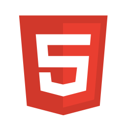
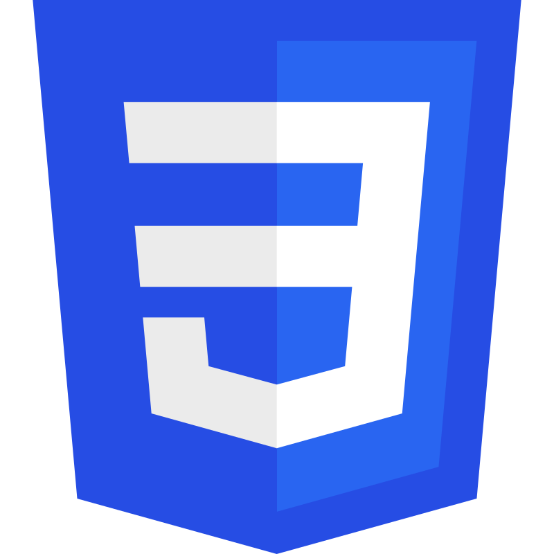
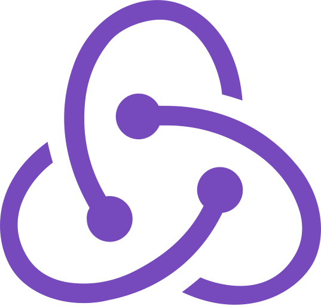

# Hi there 👋

   Welcome to my space. I'm Odi Pearl. A frontend developer who loves creating things on the web.
   I have a strong foundation in HTML, CSS, JavaScript, React, Vue, Nuxt and Next and I build responsive, user-friendly applications that scale.

## 📬 Contact
Feel free to reach out to me:
- 📧 Email: [pearlodi7@gmail.com](mailto:pearlodi7@gmail.com)
- 💼 LinkedIn: [OdI Pearl](https://www.linkedin.com/in/odipearl/)
- 🌐 Portfolio: [pearlportfolio.netlify.app](https://pearlportfolio.netlify.app/)
  
## 🌟 Skills

  
  
  
  
  

##  📓 Fun Fact
Fun fact: I love to read novels (Fantasy 100%).

## 🎯 Goals
I'm currently focused on learning and improving my skills.

